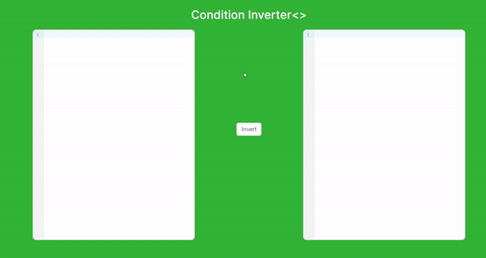
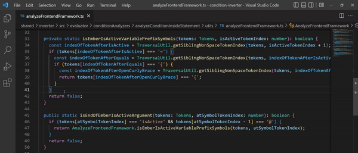

    

# Condition Inverter

Invert conditions for all modern programming languages and frameworks!

## Platforms

#### Website

[Link](http://conditioninverter.com/), [Github](https://github.com/OvidijusParsiunas/condition-inverter/tree/main/website)

    

#### VS Code Extension

[Marketplace](https://marketplace.visualstudio.com/items?itemName=OvidijusParsiunas.condition-inverter), [Github](https://github.com/OvidijusParsiunas/condition-inverter/blob/main/extension)

    

## Features
Condition Inverter has been designed to invert conditional syntax within if statements, ternary operarators, conditional assignments and many more! It is also fully functional in html templates!

## Theory
This tool takes an input condition, analyzes it and produces a new condition that yields an absolute opposite result. This is illustrated by the following table:

| Properties | Original condition | Result | Inverted condition | Result |
| :---  | :---  | :---- | :---- | :---- |
| dog = true, cat = false | dog && cat | false  | !dog &#124; &#124; !cat | true |
| dog = 3, cat = 2 | dog < cat  | false |  dog >= cat | true |

## Language Support
Condition Inverter supports all *modern* progrogramming languages and frameworks. This includes technologies that have been ranked as the most popular on the [Stack Overflow Developer Survey](https://survey.stackoverflow.co/2022/#technology-most-popular-technologies).  
As a disclaimer this tool does not currently support query, shell scripting or assembly based languages.

## Contributions

Open source is built by the community for the community. All contributions to this project are welcome!
  Additionally, if you have any suggestions for enhancements, ideas on how to take the project further or have discovered a bug, do not hesitate to create a new issue ticket and we will look into it as soon as possible!
