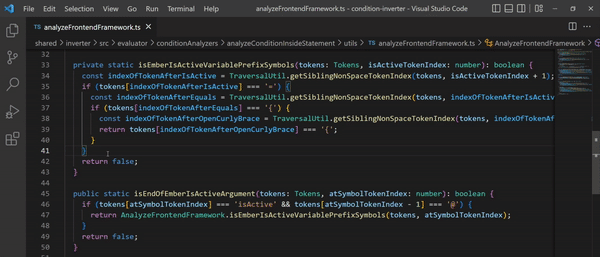

<div align="center">
    <a href="https://vsmarketplacebadge.apphb.com/version/ovidijusparsiunas.condition-inverter.svg">
        
    </a><a href="https://img.shields.io/github/workflow/status/OvidijusParsiunas/condition-inverter/push%20to%20main%20branch">
        
    </a><a href="https://img.shields.io/codecov/c/github/OvidijusParsiunas/condition-inverter">
        
    </a><a href="https://img.shields.io/testspace/tests/ovidijusparsiunas/ovidijusparsiunas:condition-inverter/main">
        
    </a>
</div>

# Condition Inverter

Invert conditions for all modern programming languages and frameworks!

<p align="center">
    
</p>

[VS Code Marketplace](https://marketplace.visualstudio.com/items?itemName=OvidijusParsiunas.condition-inverter)

## Features

TO-DO


## How to use

Highlight the area of code that you want to be inverted and press the following key combination on your keyboard:

| Operating System | Keys |
| :---  | :---  |
| Windows/Ubuntu | <kbd>ctrl</kbd> + <kbd>shift</kbd> + <kbd>i</kbd> |
| Mac | <kbd>cmd</kbd> + <kbd>shift</kbd> + <kbd>i</kbd>  |

You can alternatively rebind the keyboard combination to your preference by searching for the following command inside the *Keyboard Shortcuts* section of the VSCode editor: `condition-inverter.invert`.


## Theory

This tool has been designed to invert conditional syntax into a format that would produce an absolute opposite result. This is illustrated by the following table:

| Properties | Original if statement | Result | Inverted if statement | Result |
| :---  | :---  | :---- | :---- | :---- |
| dog = true, cat = false | dog && cat | false  | !dog &#124; &#124; !cat | true |
| dog = 3, cat = 2 | dog < cat  | false |  dog >= cat | true |

## Language Support
This tool has been designed to support all *modern* progrogramming languages/frameworks. This includes technologies that have been ranked as the most popular on the [Stack Overflow Developer Survey](https://survey.stackoverflow.co/2022/#technology-most-popular-technologies). <br>
As a disclaimer this tool does not currently support query, shell scripting or assembly based languages.

## Local setup
```
# Requirements: Node version 11+ and NPM version 6+

# Install node dependencies:
$ npm install

# Compile dependencies and run the project in watch mode:
$ npm run compile:watch

# To run tests
# Navigate to the ../shared directory and install its node dependencies:
$ npm install

# Navigate back to the ./extension directory and run tests:
$ npm run test

# Run tests with coverage:
$ npm run test:coverage
```

## Contributions

Open source is built by the community for the community. All contributions to this project are welcome! If your language/framework is not supported, you have discovered a bug, or have any suggestions for enhancements, do not hesitate to create a new ticket and we will look into it as soon as possible!
