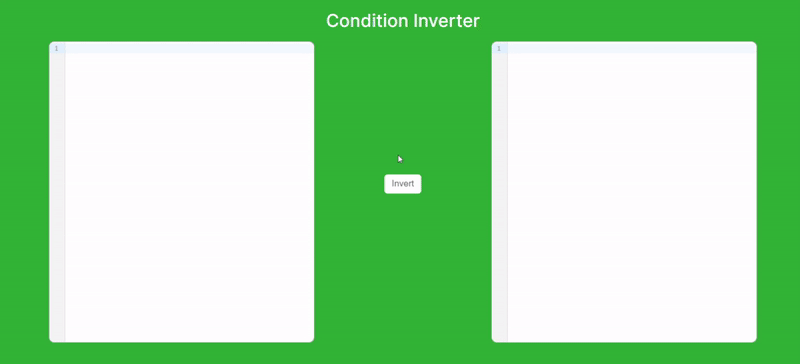

<p align="center"> 
    
</p>

<div align="center">
    <a href="https://marketplace.visualstudio.com/items?itemName=OvidijusParsiunas.condition-inverter">
        
    </a>
    <a href="https://img.shields.io/github/workflow/status/OvidijusParsiunas/condition-inverter/push%20to%20main%20branch">
        
    </a>
    <a href="https://app.codecov.io/gh/OvidijusParsiunas/condition-inverter">
        
    </a>
    <a href="https://ovidijusparsiunas.testspace.com/projects/66878/spaces">
        
    </a>
</div>

## Description

A simple tool used to invert conditions for all modern programming languages and frameworks!

<p align="center">
    
</p>

Condition Inverter is designed to invert conditional syntax within if statements, ternary operarators, conditional assignments and many more! It can also be used with html templates!


## Theory
The tool takes an input condition, analyzes it and produces a new condition that yields an absolute opposite result. This is illustrated by the following example:

| Properties | Original condition | Result | Inverted condition | Result |
| :---  | :---  | :---- | :---- | :---- |
| dog = true, cat = false | dog && cat | false  | !dog &#124; &#124; !cat | true |
| dog = 3, cat = 2 | dog < cat  | false |  dog >= cat | true |

## Language Support
Condition Inverter supports all *modern* progrogramming languages and frameworks. This includes technologies that have been ranked as the most popular on the [Stack Overflow Developer Survey](https://survey.stackoverflow.co/2022/#technology-most-popular-technologies). <br>
Disclaimer - this tool does not currently support query, shell scripting or assembly based languages.

## Local setup
```
# Requirements: Node version 11+ and NPM version 6+

# Install node dependencies:
$ npm install

# Compile the dependency in the '../shared' directory:
$ npm run compile
# or watch for any further changes in that directory using watch mode:
$ npm run compile:watch

# Run the website in watch mode:
$ npm run start
```

## Contributions

Open source is built by the community for the community. All contributions to this project are welcome!
<br> Additionally, if you have any suggestions for enhancements, ideas on how to take the project further or have discovered a bug, do not hesitate to create a new issue ticket and we will look into it as soon as possible!
